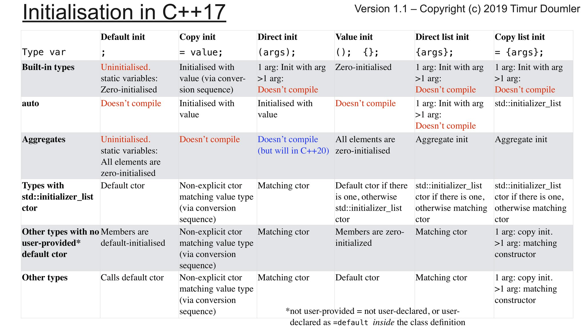

## Initialization in modern c++

> [Referencia (youtube)](https://isocpp.org/blog/2019/02/initialization-in-modern-cpp-timur-doumler-meeting-c-2018)

Demasiadas formas de inicializar variables!!

Observaciones:

- Usar list-initialisation:
  - Direc-list-initialisation Foo foo{1,2};
  - Copy-list-initialisation Foo foo = {1,2};
  - Con vectores: std::vector<int> vec{0,1,2} call vector(std::initializer_list<T> init)
  - Empty braces call default ctor and, if not exist, initializer_list
  - Problema: en templates no va bien, el código puede ser confuso, etc.
  - **No hace conversión automática de tipos!! **

En C++20: Designated initialisation!

```cpp
struct Foo {
    int a;
    int b;
    int c;
}

int main(){
    Foo foo {.a=3, .c=7}
}
```

- Sólo para tipos agregados
  - No podran declarar constructores
- C compatibility
- Como c99, excepto que:
  - no out of order
  - not nested
  - not mixed with regular initialiser
  - not with array

La idea en C++20 es que () y {} hagan lo mismo excepto:

- () no llama a std::initializer_list constructor
- {} no hace conversión automática de tipo.

Recomendaciones:

- Usar auto
- Usar '= value' para enteros y otros valores simples
- Usar '= {args}' para aggregate-init, std::initilizer_list, DMI ctors
  - En c++20 cambiará
- Usar '{}' para value-init
- Usar '(args)' para llamar a constructores que tienen argumentos. (subjetivo)

Tabla resumen:



## std::variant y pattern matching

[Referencia](https://www.youtube.com/watch?v=CELWr9roNno)

Misma idea de Ivan: una estructura/objeto por estado, y hacer pattern matching para cada estado.

std::variant == algebraic: sum data type

```cpp
using Value = std::variant<int, float, std::string>;

auto v = Value{100};
v2 = "Hello"
std::vector<Value> values{1, "hola"}
```

Cómo comprobar el valor que tiene dentro?

```cpp
// option 1: check alternative
if(hods_alternative<int>(v)) auto i= get<int>(v);

// option 2: get pointer
if(auto pi= get_if<int>(&v)) auto i = *pi;

// option 3: visitor
struct Visitor {
    void operator()(int i){
        // ...
    }
    void operator()(float f){
        // ...
    }
}
visit(Visitor{},var);

// Option 4: overloaded helper
// Pattern matching: referencia scala pattern-matching.html
template <typename... Ts>
struct overloaded: Ts...
{
    using Ts::operator()...;
};

template<typename ... Ts>
overloaded(Ts...) -> overloade<Ts...>;

variant<int, float> myVar{2.5f};
visit(overloaded{
    [](int i){},
    [](float f){}
}, myVar);

// Option 5: match based on option 4. C++17
template<typename Variant, typename... Handlers>
auto match(Variant&& v, Handlers&&... handlers) {
	return std::visit(
		overloaded{std::forward<Handlers)(handlers)...},
        std::forward<Variant(v)
	);
}

match(var,
     [](int i){},
     [](float f){}
     );
```

Ejemplos de uso:

- State machine

  - Cada estado como estructura diferente

  - SE introducen todas en variant

  - se hace match

  - State transitions:

    - Problem Reasigning state inside match:

    ```cpp
    struct State1 { int mFoo};
    struct State2 {};
    std::variant<State1, State2> mState = State1{};

    // Problem
    match(mState,
    [=](const State1& state) {
        mstate = State2
        if(state.mFoo) ... // Undefined behaviour.  state comes from mstate, and we have changed it
    });
    // Solution
    using MaybeNextState = std::optional<State>;

    auto maybeNextState = match(mstate,
    [=](const State1& state) -> MaybeNextState {
        if(...) return State{State2{}};
        return std::nullopt;
    });

    if (maybeNextState) mState = *maybeNextState;
    ```

    - No hay seperación entre comportamiento del estado y transición de estados.
    - No recomendado cuando hay muchos estados/transiciones. En este caso, usar librería para máquina de estados.

- Event handling (mousemoved, mousebutton Down)

  - Usar para internal event handling

- Return values

  ```cpp
  using InterserctResult = std::variant<Point, NoIntersection, Containment>;
  IntersectResult testIntersectionconst Ray&, const Plane& plane)
  ```

futuro:

- Native pattern matching proposal: inspect

## A new look at Template metaprogramming

[Referencia](https://www.youtube.com/watch?time_continue=103&v=Q17nCnXGRQs)

Ver <> como paréntesis: funciones con entrada y acceso a salida de diferentes formas.

MetaFunctions: Funciones que trabajan con tipos

- Trasnforman tipos en tipos
- Mapea tipos a valores
- Mapea valores a tipos

Ejemplo: Suma de elementos de una colección. Valor devuelto? usar inner_type_t(la colección debe tener definido type_t)

```cpp
template typename C, typename Val = inner_type_t<C>>
Val sum(const C& collection) { return std::accumulate(...);}
```

## The hitchhiker's guide to faster builds

[Referencia](https://www.youtube.com/watch?v=WY2SluG-Dv0)

Proceso de build:

- Preprocessor: source file -> translation unit
  - includes
  - macros, ifdef
- compiler: translation unit -> object file
  - parsing, tokens, ast
  - optimizations
  - code generation
- linker: object files & libraries -> executable

Why so long?

- 'includes'
- lenguaje complejo
- tools
- proyecto structure...

Problemas con include

- textual (el resultado no se puede cachear)
- Implementation dependencies (privately used types by value need the definition)
- el mismo código se compila multiples veces
- templates se reinstancia el mismo tipo, se requiere más código en cabeceras, etc.
- inline functions en headers

Debug vs release

- Compilador hace menoms en debug
- Niveles de optimización

Eliminar unreachable Dead code:

- Clang warning: -Wunused, -Wunused-function, -ffunction/data-sections, -Wl,--gc-sections, --print-gc-sections
- cppcheck --enable=unusedFunction
- coverity
- understand by scitools
- cppdepend
- pvs studio
- oclint
- parasoft c test
- polyspace
- oovcde
- gcov

Encontrar includes innecesarios

- specific includes mejor que 'include everything'
- https://include-what-you-use.org/
- doxygen y graphviz
- https://github.com/myint/cppclean
- Header Hero
- cpp-dependencies
- resharper includes analyzer
- includator
- deheader
- msvc: showincludes
- gcc: -h

Declarations vs definitions

- functions:
  - fwd decl
- types:
  - fwd decl
  - **fwd decl used by value in signature**
  - fwd decl used as a pointer

Third party libraries:

- Hacer un wrapper de los tipos/headers
- Dedicated headers with forward declarations

PIMPL - pointer to implementation (private implementation)

- Compilation firewall

  ```cpp
  // widget.h
  struct widget {
      widget();
      ~widget(); // cannot be defaulted here
      void foo()
  private:
      struct impl; // just a fwd decl
      std::unique_ptr<impl> m_impl;
  };

  // widget.cpp
  struct widget::impl {
      void foo(){}
  };

  widget::widget(): m_impl(std::make_unique<widget::impl>()){}
  widget::~widget() = default;
  void widget::foo(){ m_impl->foo();}
  ```

- pros:
  - breaks the interface/implementation dependecy
    - less dragged headers
    - Implementation data members no affect the size
  - helps preventing ABI
- Const:
  - Requires allocation, space overhead for pointers
  - extra indirection of calls
  - more code, propagation, copy, etc...

Abstract interfaces & factories

- Implementations of derived are obtained through factory

  ```cpp
  // interface.h
  struct IBase {
      virtual int do_stuff() = 0;
      virtual ~IBase() = default;
  }

  std::unique_ptr<Ibase> make_der_1(int);
  std::unique_ptr<IBase> make_der_2();

  // interface.cpp
  struct Derived1: public IBase {};
  struct Derived2: public IBase {};
  ...
  ```

- pros:
  - breaks the interface/implementation dependency
  - help preserving ABI
- cons:
- requires allocation
- extra indirections of calls
- more code
- users work with pointers intead of values
- link time optimization harder than for pimpl

Precompiled headers

```cpp
//precompiled.h
// system, runtime, stl
#include <vector>

// third-party
#include <doctest.h>

// rarely changin project-specific
# include "utils/transform.h"

```

- put headers that are used in many of the sources
- put headers that dont change often
- do regular audits to reflect the latest needs
- hack?
- gcc/clang: '-x c++-header'
  - only one PCH per translation unit
- cmake con 'cotire' o 'cmake-precompiled-header'
- meson native

Unity builds

- AKA: amalgamated, jumbo

- Idea: include all original source files in one or a few unity source file(s)

  ```cpp
  // unity file
  #include "core.cpp"
  #include "widget.cp"
  #include "gui.cpp

  ```

- pro:
  - headers get parsed only once if included from multiple sources
  - less compiler invocations
  - less instantiations of the same templates
  - less linker work. Usado por Ubisoft
  - ODR (one definition rule) violations get caught. Permite detectar funciones/tipos definidas en más de un archivo
  - Enforces code hygiene (include guards in headers, no static and anon namespaces in headers, ...)
- cons
  - minimal rebuilds: rebuild a lot if one change
  - interfere with parallel compilation
  - some files stop compileng as a unity
  - miscompilation
- Plugins: cotire, fastbuild, visual studio

Inlining annotations:

- explicit disable inlining: **declspec(noinline) / **attribute\_\_((noinline))

Templates:

- Odin HOlmes - the fastest template metaprogramming in the West
- metashell - interactive template metaprogramminmg shell (msgui)
- templight
- 'optimizin compilation times with templates'
- boost.tmp your dsl for metaprogramming

Diagnóstico:

clang/gcc: -ftime-report

- bloaty mcbloatface
- aras-p/sizer

Build systems

- Parllel builds:
  - Ninja (parallel builds)
  - make: -jN
- IncrediBuild build monitor
- FastBuild

Linking:

- Prefer dynamic (.dll, .so, .dylib) over static (.lib, .a)
- gold (unix)
  - -fuse-ld=gold
  - --enable-threads
  - --threads --thread-count COUNT --preread-archive-symbols
- ldd (lld.llvm.org) (el mejor)
- split dwarf llvm
- clang ThinLTO (link-time optimization")

Dynamic linking - symbol visibility

- Unix: all symbols exported by default
  - opposite to windows
- Unix: compile with -fvisibility-hidden

Compiler caches (wrapper)

- ccache (gcc, clang)
- windows: clcache, cclash
- fashbuild
- sccache
- stashed.io

Distributed builds

- distcc, icecream, incredibuild, fastbuild

Hardware

- more cores, ram
- temp folder as ram disk

Physical design

- physical structure and c++ - a first look
- John lakos:
  - large-scale c++ software design
  - c++ modules & large-scale development

Dependency analysis

- cmake --graphviz=file
- Finding unnecessary includeds
  - understand
  - cppdepend
  - dpp-dependencies
  - doxygen

Modules

- motivation:

  - compile time
  - preprocessor includes (leaked symbol, name clashes, tooling hard, include guards, include order matters )
  - dry (forward declarations, code duplication)

- ej vs2017

  ```cpp
  import std.core; // containers, string
  export module M_1; // named M_1

  export std::vector<std::string> getString(){}

  // ...

  // .. main
  import std.core
  import M_1;
  int main() {
      auto v = getString();
      //...
  }
  ```

- BMI (binary module interface) files
  - Consumed by importers
  - produced by compiling a MIU (module interface unit)
  - (maybe) contains serialized AST
  - composability of multiple modules
  - explicit code annotations to define visible interfaces
  - (msvc, clang, gcc)

## Test

cppcon 2017 mix test and production code with doctest - implementation and usage"

## Markdown a presentaciones!!

[enlace a marp](https://yhatt.github.io/marp/)

## Recomendaciones

Usar std::for_each(elemento, función) sobre range-based for loop (for(auto number: numbers): [enlace](https://www.fluentcpp.com/2019/02/07/why-you-should-use-stdfor_each-over-range-based-for-loops/)

[listado de recursos awesomecpp](https://awesomecpp.com/)

[cpp best practices](https://lefticus.gitbooks.io/cpp-best-practices/content/)

- build tools: cmake (cotire, cmakepp, cmake_format) / ninja / fastbuild /meson

- package manager conan/qpm/build2

- continous integration: Travis CI/AppVeyor/Hudson/Jenkins

- Gcc / Clang flags (considerar -Weverything:

  ```
  -Wall -Wextra -Wshadow -Wnon-virtual-dtor -pedantic -Wold-style-cast -Wunused -Woverloaded-virtual -Wpedantic --Wduplicated-cond -Wduplicated-branches -Wlogical-op -Wnull-dereference
  ```

- clang-tidy (linter)
- include-what-you-use
- static analyzer: cppcheck (--enable=all --check-config -j1) and clang, cppclean,
  - flint++ linter agains facebook coding standard
  - oclint
  - clazy (qt usage)
- coverity scan (scan.coverity.com) (works with travis ci). pvs studio

  - codecov, coveralls, lcov, gcovr, kcov, opencppcoverage

- debugging: uftrace, rr
- code analysys: lizard, metrix++, abi compliance checker
- cncc (custimizable naming convention checker)
- clangformat
- Herramientas de cache: ccache, warp
- poner tmp en ramdisk, usar gold linker en linux

- Clases comienzan con mayúsuclas

- funciones y variables con minúsculas

- constantes en mayuscula

- template parameter con camelcase

- objetos privados con m\_ (member data)

- function parameters prefijados con t\_ (the)

- no comenzar nada con \_

- usar nullptr

- comentarios siempre //

- nunca usar namespace en cabeceras

- incluir guards

- requerir {} en bloques

- incluir "" para archivos locales; <> para includes del sistema

- hpp, cpp

- evitar conversiones implícitas. Marcar con 'explicit'

- const siempre que sea posible.

- nunca pasar const ref para tipos básicos (es más lento que usar registros)

- usar siempre override en derivadas

- usar std::filesystem, std::thread

- forward declare cuando sea posible

- Habilitar move operations cuando se declaran constructores explicitos: ModelObject(ModelObject &&) = default)

- Asignar variables con ternary operator o funciones lambda (immediately-invoked lambda)

  ```cpp
  // Better Idea
  const std::string somevalue = [&](){
      if (caseA) {
        return "Value A";
      } else if (caseB) {
        return "Value B";
      } else {
        return "Value C";
      }
    }();
  ```

- Evitar new (usando make_shared/make_unique)
- Preferir double a float

[42 convenciones de Andrey Karpov ](https://www.viva64.com/en/b/0391/#ID0E5CAE)

[Encontrar cabeceras más usadas](http://bitsquid.blogspot.com/2011/10/caring-by-sharing-header-hero.html)

## Microservicios

### DDS y microservicios

[presentaciión de prismtech](https://www.slideshare.net/PrismTech1/prismtech-microservice-architectures-with-vortex-part-2?next_slideshow=1)

[DDS tutorial](https://www.prismtech.com/products/vortex/resources/youtube-videos-slideshare/prismtech-data-distribution-service-tutorial)

[Modelar datos como bbdd relacional](https://www.prismtech.com/products/vortex-dds/resources/youtube-videos-slideshare/art-and-science-dds-data-modeling)

[DDS y calidad de servicio](https://www.prismtech.com/products/vortex-dds/resources/youtube-videos-slideshare/mastering-dds-qualities-service)

[DDS en acción](https://www.prismtech.com/products/vortex/resources/youtube-videos-slideshare/data-distribution-service-action-part-1)

### Microservicios y git

[enlace a blog](https://hackernoon.com/micro-services-git-d840305e6220)

REcomendación: un sólo repositorio para todos los servicios, organizando ramas por apis

### Comunicación entre servicios vía grpc

https://grpc.io/docs/guides/

https://www.infoq.com/presentations/api-pb-grpc

https://github.com/grpc-ecosystem

[best practices](https://www.youtube.com/watch?time_continue=1112&v=Z_yD7YPL2oE)

[elixir y grpc](https://medium.com/@aleksandrasays/elixir-with-a-drop-of-grpc-cb2569ddee4b)

### Habilitar/deshabilitar características

https://martinfowler.com/articles/feature-toggles.html

### Docker y c++

[deployment and development with docker](https://blogs.msdn.microsoft.com/vcblog/2019/02/06/using-vs-code-for-c-development-with-containers/)

### Scilab

[Code generator](https://atoms.scilab.org/toolboxes/xcos_code_generator)

[argo-project](http://www.argo-project.eu/the-argo-approach/)

### gRPC

[video lyft - grpc, idl, etc](https://www.infoq.com/presentations/api-pb-grpc)

### CMake

[more modern cmake](https://www.youtube.com/watch?v=y7ndUhdQuU8)
