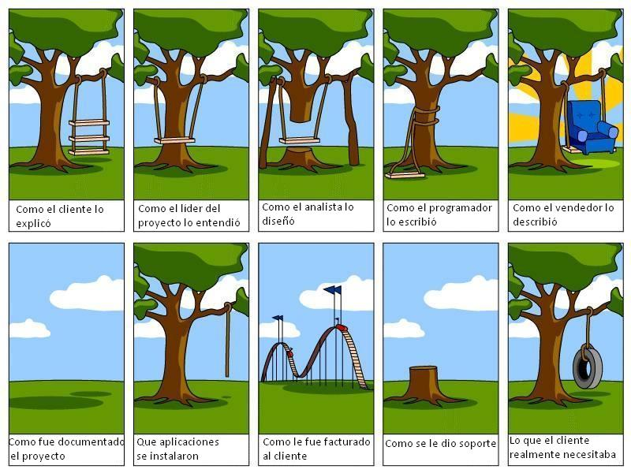

## Herramientas de diseño software

Durante las etapas de análisis y diseño de un sistema se requiere modelar los diferentes aspectos que lo definen (estructura, comportamiento, relación con otros sistemas, etc.). La forma más extendida de modelar un sistema software es mediante la creación de diagramas gráficos que permitan su comprensión.

Existen varios lenguajes visuales que tratan de unificar la visión de un sistema a través de elementos gráficos. De entre ellos, el lenguaje [UML](https://omg.org/spec/UML/2.5.1) (Unified modeling language) puede considerarse el estándar de facto.

### UML

En su especificación se incluyen diagramas que permiten modelar la estructura y comportamiento del sistema (actividades, estados, componentes y sus interacciones, interfaces, etc.). El mercado está repleto de herramientas software que facilitan la generación de diagramas UML, como por ejemplo:

- [draw.io](https://www.draw.io). Herramienta Online (gratuita/versión de pago) que permite la generación de todo tipo de diagramas, incluidos UML.
- [StarUML](https://staruml.io). Aplicación de Escritorio (de pago) especializada en la generación de diagramas UML 2. Dispone de utilidades avanzadas como la generación de código fuente basado en los diagramas o a generación automática de diagramas a través de la inspección de código fuente existente.
- [Visual Paradigm](https://www.visual-paradigm.com). Aplicación de Escritorio (de pago). Asiste en la creación de todo tipo de diagramas, entre los que se encuentra UML 2.
- [PlantUML](http://plantuml.com). Aplicación de consola (gratuita). En este caso, los diagramas UML se declaran usando un editor de texto plano y la aplicación genera las imágenes correspondientes.
- [Visual Studio](https://visualstudio.microsoft.com/es/). Aplicación de escritorio (gratuita/versión de pago). Entorno completo de desarrollo que también integra UML.
- [Dia](dia-installer.de/index.html.es). Aplicación de escritorio (gratuita). Obsoleta pero muy conocida.

### SysML

SysML es un lenguaje de especificación de sistemas (subconjunto ampliado de UML 2.0), desarrollado por la necesidad de definir sistemas generales (no necesariamente software). Entre sus ampliaciones cabe destacar la posibilidad de generar diagramas de requisitos y sistemas de ecuaciones paramétricas. En su [web oficial](https://sysml.org/sysml-tools/) se incluye un listado de herramientas software compatibles con SysML

## Herramientas de validación y verificación software

La validación y verificación del sistema implementado es imprescindible para certificar que:

1. El sistema cumple con las especificaciones definidas en los requisitos del proyecto. Sirva la siguiente imagen para reflejar hasta qué punto puede desviarse la idea inicial del sistema respecto al producto que finalmente se desarrolla.

   

2. El sistema se comporta de una manera predecible.

3. El sistema es robusto en el sentido más general de la palabra

   1. Robusto frente a casos límite (programación defensiva)
   2. Robusto en cuanto a tolerancia a cambios (adaptabilidad)
   3. etc.

En las dos últimas décadas se ha invertido un gran esfuerzo en el estudio de la calidad del software, apareciendo varias metodologías (incluso vertientes ideológicas) que pretenden, por un lado, mejorar la calidad del producto desarrollado y, por otro, facilitar la trazabilidad entre los requisitos y las partes del sistema que los implementan.

### Validación de requerimientos

Las herramientas de gestión de proyectos software permiten enlazar requisitos de un proyecto con otros 'artefactos' definidos en el proyecto (o en otros proyectos relacionados). Estos artefactos pueden ser:

- Bloques de código fuente
- Productos terminados (ejecutables)
- Cualquier otro recurso.

Gracias a estas relaciones los requisitos del sistema quedan ligados a detalles de implementación junto a otra información de interés (histórico de cambios, pruebas de validación del código automática, etc.).

La siguiente lista recoge las herramientas de gestión de proyectos software más relevantes en la actualidad:

- [Jira](https://es.atlassian.com/software/jira). Herramienta (de pago) de gestión de proyectos de Atlassian. Disponible como servicio web y como aplicación cliente/servidor descargable. Softwre de seguimiento de proyectos e incidencias.
- [Team Foundation Server (tfs)](https://visualstudio.microsoft.com/es/tfs/). Herramienta (de pago) de gestión de proyectos de Microsoft. Disponible como servicio web y como aplicación cliente/servidor descargable. Incluye, entre otras cosas, herramientas de control de código fuente y gestión de requisitos.
- [PivotalTracker](https://pivotaltracker.com). Herramienta (de pago) de gestión de proyectos. Una alternativa orientada a metodologías de desarrollo software ágiles.

### Verificación del sistema. Calidad

La verificación del software se incluye dentro de un término más amplio conocido como 'calidad software'.

Un software de calidad no sólo funciona según se especificó sino que, además, posee ciertas características. Por citar algunas de ellas:

- Es fácilmente adaptable ante cambios de requisitos
- Su comportamiento es predecible en el mayor número de casos posible.
- Es robusto
- Es fácil verificar su funcionamiento

Para cuantificar la calidad del software se han desarrollado métricas que miden diferentes aspectos del sistema:

- Líneas de código que comprende el sistema
- Porcenta de código cubierto con pruebas automáticas.
- Acoplamiento entre las diferentes partes del sistema
- Detección de malas prácticas/posibles fuentes de error
- etc.

El software que se usa para medir la calidad de un sistema suele estar relacionado con las tecnologías en que se ha implementado el sistema, por lo que el abanico es muy amplio. Por ejemplo, para entornos que usan como lenguaje de programación C/C++ existe un listado de herramientas muy completo en la [Wikipedia](https://en.wikipedia.org/wiki/List_of_tools_for_static_code_analysis#C,_C++). Por citar algunas de ellas:

- cppdepend
- cppcheck
- [froglogic Coco code coverage](www.froglogic.com). Aplicación de Escritorio (de pago) que analiza la cobertura de código fuente verificado con pruebas.

#### Pruebas automáticas

Uno de los aspectos que permiten medir la calidad del software es la existencia de diferentes pruebas automáticas que comprueben que el sistema se comporta según lo esperado.

El desarrollo de test automáticos favorece múltiples facitas del sistema

- Adaptabilidad y robustez frente a cambios. Al modifica una parte del software es más fácil evaluar cómo se ha visto afectado el resto del sistema.
- Comportamiento predecible. Ahora el sistema no sólo está definido en un documento de requisitos, sino que existen pruebas automáticas que dictan cómo debe comprobarse el sistema y permiten detectar precozmente comportamientos anómalos/indeseados.
- Robustez frente a errores conocidos. Cuando se detecta y corrige un nuevo error, se puede generar una prueba que compruebe que está solucionado. De esta forma, se asegura que el mismo error no volverá de forma recurrente en futuras modificaciones del sistema.

Existen pruebas de software de diferente índole (estáticas/dinámicas, funcionales, etc.), y herramientas software específicas que facilitan la creación de pruebas y la ejecución de las mismas. En sistemas desarrollados en C/C++, destacan las siguientes librerías/utilidades (listado completo en [Wikipedia](https://en.wikipedia.org/wiki/List_of_unit_testing_frameworks#C)):

- [Cmocka](https://cmocka.org/). C unit test framework.
- [CUnit](cunit.sourceforge.net). C unit test framework.
- [CTest](vtk.org/Wiki/CMake_Testing_With_CTest). C unit test framework.
- [Googletest](https://github.com/google/googletest). C++ unit test framework.
- [Catch 2](http://github.com/catchorg/Catch2). C++ unit test framework.
- [CppTest](cpptest.sourceforge.net/). C++ unit test framework.
- [Boost Test](https://www.boost.org/doc/libs/1_66_0/libs/test/doc/html/index.html). C++ unit test framework.

## Documentación de código fuente.

Es posible usar el mismo código fuente del sistema como punto origen de documentación. Dos posibilidades son:

1. Usar pruebas unitarias como documentación. Cada prueba muestra una parte de la interfaz de la aplicación y un ejemplo de caso de uso.
2. Comentar el código fuente (archivos, clases, funciones, etc.) usando una síntaxis predefinida que permita a otras herramientas extraer dicha información y generar documentación automática. En entornos de programación C/C++, destaca el generador de documentación [Doxygen](www.doxygen.org). Doxygen inspecciona todo el código fuente de un sistema y, a partir de los comentarios encontrados, genera documentación en diferentes formatos (html/latex/pdf/etc.), gráficas que muestran relaciones entre los diferentes componentes, etc.
