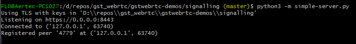
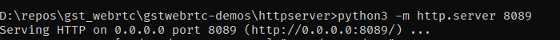
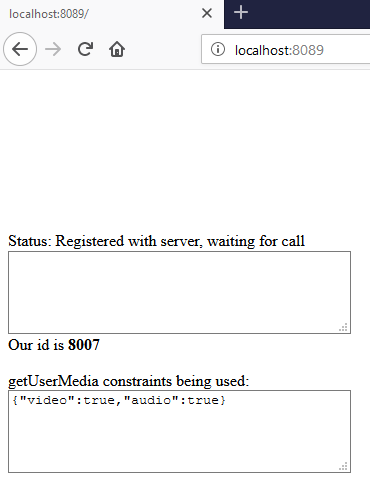
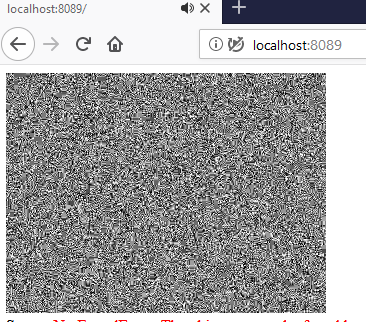

## Referencias

> Referencia:
>
> - [Centricular - gstwebrtc demos](https://github.com/centricular/gstwebrtc-demos)
> - [Nirbheek's Rantings - Blog Gstreamer y webrtc](http://blog.nirbheek.in/)
> - [GStreamer Plugins list](https://gstreamer.freedesktop.org/documentation/plugins_doc.html?gi-language=c)
> - [Plugin 'bad' webrtc (incluye elemento webrtcbin)](https://gstreamer.freedesktop.org/data/doc/gstreamer/head/gst-plugins-bad/html/gst-plugins-bad-plugins-plugin-webrtc.html)
> - [Pipeline usado por usuario stack overflow](https://stackoverflow.com/questions/54175675/gstreamer-webrtc-should-my-pipeline-be-multipliexed)
> - [Pipeline probados por usuario en chrome/firefox](https://stackoverflow.com/questions/54170588/webrtc-h264-video-garbled-chrome) > [Patrones videotestsrc](https://gstreamer.freedesktop.org/documentation/videotestsrc/index.html?gi-language=c#GstVideoTestSrcPattern)

## Plugin Oficial: webrtcbin

### Prerrequisitos

#### Windows 10

1. [MSYS2](https://www.msys2.org/)

   1. Compilador gcc, gstreamer.

   ```bash
   $ pacman -S --needed base-devel mingw-w64-x86_64-toolchain

   $ pacman -S pkg-config mingw-w64-x86_64-gstreamer mingw-w64-x86_64-gst-plugins-base mingw-w64-x86_64-gst-plugins-good mingw-w64-x86_64-gst-plugins-bad mingw-w64-x86_64-gst-plugins-ugly mingw-w64-x86_64-gst-libav mingw-w64-x86_64-gst-rtsp-server
   ```

2. [Python 3](https://www.python.org/ftp/python/3.7.3/python-3.7.3.exe)

   1. Módulo websocket de Python:

   ```bash
   $ pip3 install –user websockets
   ```

3. Navegador web Firefox/ Chrome
   En Google Chrome, tenéis que lanzarlo para que permita conexiones no seguras

   ```bash
   $ chrome.exe --ignore-certificate-errors --unsafely-treat-insecure-origin-as-secure=https://localhost/

   $ chrome.exe --allow-insecure-localhost
   ```

4. [OpenSSL](https://slproweb.com/products/Win32OpenSSL.html)
   Agregar carpeta `bin` al PATH de Windows

### Descarga de demos

Descargar repositorio de demos Webrtc

```bash
$ git clone https://github.com/centricular/gstwebrtc-demos.git
```

### Generación de certificados para servidor de señalización

En la subcarpeta `signalling`, generar certificados ssl autofirmados:

```bash
$ openssl req -x509 -newkey rsa:2048 -keyout key.pem -out cert.pem -days 365
```

> A la salida deben aparecer dos nuevos ficheros: `key.pem` y `cert.pem`

### Compilación del ejemplo

Compilar `sendrecv/gst/webrtc-sendrecv.c` siguiendo las instrucciones de la web:

```bash
$ gcc webrtc-sendrecv.c $(pkg-config --cflags --libs gstreamer-webrtc-1.0 gstreamer-sdp-1.0 libsoup-2.4 json-glib-1.0) -o webrtc-sendrecv
```

> A la salida debe aparecer un nuevo ejecutable: webrtc-sendrecv

### Inicio de servidor de señalización

En la subcarpeta `signaling` iniciar el servidor de señalización:

```bash
$ python3 -m simple-server.py
```

> Por defecto, arrancará en el puerto `8443`



### Inicio de servidor web

En la subcarpeta `sendrecv/js`, lanzar un servidor web de páginas estáticas

```bash
$ python3 -m http.server 8089
```



Tras ello, acceder con el navegador a la dirección `http://localhost:8089`



> Anotar el ID que se le asigna al usuario del navegador

### Inicio de aplicación de ejemplo

Iniciar la aplicación pasando como parámetros:

- Dirección del servidor de señalización
- ID del usuario con el que se desea iniciar la comunicación

Ejemplo:

```bash
$ ./webrtc-sendrecv.exe --peer-id=3143 --server=wss://localhost:8443
```


> Como resultado, en el navegador web debería aparecer el video transmitido desde consola. A su vez, el video/audio transmitido desde el navegador deberá aparecer en una nueva ventana flotante del sistema operativo.



### Modificación de la aplicación de ejemplo

Por defecto, el código del repositorio transmite una carta de ajuste.
Para que, en su lugar, transmita video procedente de una webcam, hay que cambiar la función `start_pipeline` del fichero `webrtc-sendrecv.c`.
Nuevo pipeline:

```c
pipe1 = gst_parse_launch ("webrtcbin bundle-policy=max-bundle name=sendrecv " STUN_SERVER "autovideosrc device=/dev/video0 ! videoconvert ! queue ! vp8enc deadline=1 ! rtpvp8pay ! " "queue ! " RTP_CAPS_VP8 "96 ! sendrecv. " "audiotestsrc is-live=true wave=red-noise ! audioconvert ! audioresample ! queue ! opusenc ! rtpopuspay ! " "queue ! " RTP_CAPS_OPUS "97 ! sendrecv. ", &error);
```

Tras ello, volver a compilar la aplicación y lanzarla.

> En el navegador web debería aparecer el streaming de la webcam.

### Otros Pipelines GStreamer

#### Envío y recepción en consola

> Referencia: [stack overflow](https://stackoverflow.com/questions/53267038/gstreamer-webrtcbin-working-sample-pipeline)

Envío:

```bash
$ gst-launch-1.0 webrtcbin bundle-policy=max-bundle name=sendrecv  stun-server=stun://stun.l.google.com:19302 audiotestsrc is-live=true wave=red-noise ! audioconvert ! audioresample ! queue ! opusenc ! rtpopuspay ! application/x-rtp,media=audio,encoding-name=OPUS,payload=97 ! sendrecv.
```

Recepción:

```bash
$ gst-launch-1.0 webrtcbin bundle-policy=max-bundle name=sendrecv stun-server=stun://stun.l.google.com:19302 ! rtpopusdepay ! opusdec ! audioconvert ! autoaudiosink async=false
```

#### Envío y recepción webcam (linux)

```bash
$ gst-launch-1.0 v4l2src ! videoconvert ! queue ! vp8enc deadline=1 ! rtpvp8pay ! application/x-rtp,media=video,encoding-name=VP8,payload=96 ! webrtcbin name=sendrecv
```

> Referencia: [Centricular - Issue 8](https://github.com/centricular/gstwebrtc-demos/issues/8)

## Otros Servidores de señalización

- [Janus server](https://janus.conf.meetecho.com/)

## Plugin RidgeRun WebRTC (rrwebrtcbin)

- [Introducción](https://developer.ridgerun.com/wiki/index.php?title=GstWebRTC_-_GstWebRTC_Basics)

- [Pipeline (con ejemplos)](https://developer.ridgerun.com/wiki/index.php?title=GstWebRTC_Pipelines)

- [Envío y recepción usando AppRTC](https://developer.ridgerun.com/wiki/index.php?title=GstWebRTC_-_AppRTC_Web_Page_-_x86)

- [Envío y recepción usando PubNub](https://developer.ridgerun.com/wiki/index.php?title=GstWebRTC_-_PubNub_Video_Examples_-_x86)
  - Web de PubNub: [enlace](https://webrtc.ridgerun.com:7443/)
